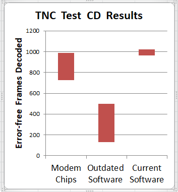
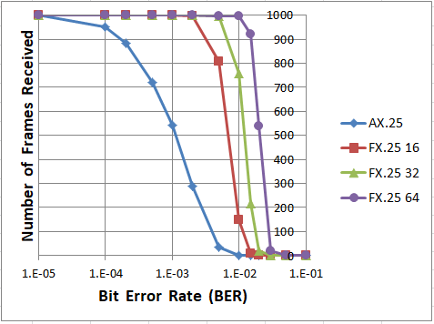

# Dire Wolf #

### Decoded Information from Radio Emissions for Windows Or Linux Fans ###

In the early days of Amateur Packet Radio, it was necessary to use an expensive "Terminal Node Controller" (TNC) with specialized hardware.  Those days are gone.  You can now get better results at lower cost by connecting your radio to the "soundcard" interface of a computer and using software to decode the signals.

Why waste $200 and settle for mediocre receive performance from a 1980's technology  TNC using an old modem chip?   Dire Wolf decodes over 1000 error-free frames from Track 2 of the [WA8LMF TNC Test CD](https://github.com/wb2osz/direwolf/tree/dev/doc/WA8LMF-TNC-Test-CD-Results.pdf), leaving all the hardware TNCs, and first generation "soundcard" modems, behind in the dust.

Dire Wolf includes [FX.25](https://en.wikipedia.org/wiki/FX.25_Forward_Error_Correction) which adds Forward Error Correction (FEC) in a way that is completely compatible with existing systems.  If both ends are capable of FX.25, your information will continue to get through under conditions where regular AX.25 is completely useless. This was originally developed for satellites and is now seeing widespread use on HF.

Version 1.7 adds [IL2P](https://en.wikipedia.org/wiki/Improved_Layer_2_Protocol), a different method of FEC with less overhead but it is not compatible with AX.25.

### Dire Wolf is a modern software replacement for the old 1980's style TNC built with special hardware. ###

Without any additional software, it can perform as:

 - APRS GPS Tracker
 - Digipeater
 - Internet Gateway (IGate)
- [APRStt](http://www.aprs.org/aprstt.html) gateway

It can also be used as a virtual TNC for other applications such as [APRSIS32](http://aprsisce.wikidot.com/), [Xastir](http://xastir.org/index.php/Main_Page), [APRS-TW](http://aprstw.blandranch.net/), [YAAC](http://www.ka2ddo.org/ka2ddo/YAAC.html), [PinPoint APRS](http://www.pinpointaprs.com/), [UI-View32](http://www.ui-view.net/),[UISS](http://users.belgacom.net/hamradio/uiss.htm), [Linux AX25](http://www.linux-ax25.org/wiki/Main_Page), [SARTrack](http://www.sartrack.co.nz/index.html), [Winlink Express (formerly known as RMS Express, formerly known as Winlink 2000 or WL2K)](http://www.winlink.org/RMSExpress), [BPQ32](http://www.cantab.net/users/john.wiseman/Documents/BPQ32.html), [Outpost PM](http://www.outpostpm.org/), [Ham Radio of Things](https://github.com/wb2osz/hrot), [Packet Compressed Sensing Imaging (PCSI)](https://maqifrnswa.github.io/PCSI/), and many others.
 
 
## Features & Benefits ##

### Dire Wolf includes: ###

- **Beaconing, Tracker, Telemetry Toolkit.**

     Send periodic beacons to provide information to others.  For tracking the location is provided by a GPS receiver.
     Build your own telemetry applications with the toolkit.

- **APRStt Gateway.**

     Very few hams have portable equipment for APRS but nearly everyone has a handheld radio that can send DTMF tones.  APRStt allows a user, equipped with only DTMF (commonly known as Touch Tone) generation capability, to enter information into the global APRS data network.  Responses can be sent by Morse Code or synthesized speech.

- **Digipeaters for APRS and traditional Packet Radio.**

    Extend the range of other stations by re-transmitting their signals. Unmatched flexibility for cross band repeating and filtering to limit what is retransmitted.

- **Internet Gateway (IGate).**

    IGate stations allow communication between disjoint radio networks by allowing some content to flow between them over the Internet.

- **Ham Radio of Things (HRoT).**

    There have been occasional mentions of merging Ham Radio with the Internet of Things but only ad hoc incompatible narrowly focused applications. Here is a proposal for a standardized more flexible method so different systems can communicate with each other.

    [Ham Radio of Things - IoT over Ham Radio](https://github.com/wb2osz/hrot)

- **AX.25 v2.2 Link Layer.**

    Traditional connected mode packet radio where the TNC automatically retries transmissions and delivers data in the right order.

- **KISS Interface (TCP/IP, serial port, Bluetooth) & AGW network Interface (TCP/IP).**

    Dire Wolf can be used as a virtual TNC for applications such as [APRSIS32](http://aprsisce.wikidot.com/), [Xastir](http://xastir.org/index.php/Main_Page), [APRS-TW](http://aprstw.blandranch.net/), [YAAC](http://www.ka2ddo.org/ka2ddo/YAAC.html), [PinPoint APRS](http://www.pinpointaprs.com/), [UI-View32](http://www.ui-view.net/),[UISS](http://users.belgacom.net/hamradio/uiss.htm), [Linux AX25](http://www.linux-ax25.org/wiki/Main_Page), [SARTrack](http://www.sartrack.co.nz/index.html), [Winlink Express (formerly known as RMS Express, formerly known as Winlink 2000 or WL2K)](http://www.winlink.org/RMSExpress), [BPQ32](http://www.cantab.net/users/john.wiseman/Documents/BPQ32.html), [Outpost PM](http://www.outpostpm.org/), [Ham Radio of Things](https://github.com/wb2osz/hrot), [Packet Compressed Sensing Imaging (PCSI)](https://maqifrnswa.github.io/PCSI/), and many others.

### Radio Interfaces:   ###

- **Uses computer's "soundcard" and digital signal processing.**

    Lower cost and better performance than specialized hardware. 

    Compatible interfaces include [DRAWS](http://nwdigitalradio.com/draws/), [UDRC](https://nw-digital-radio.groups.io/g/udrc/wiki/UDRC%E2%84%A2-and-Direwolf-Packet-Modem), [SignaLink USB](http://www.tigertronics.com/slusbmain.htm), [DMK URI](http://www.dmkeng.com/URI_Order_Page.htm), [RB-USB RIM](http://www.repeater-builder.com/products/usb-rim-lite.html), [RA-35](http://www.masterscommunications.com/products/radio-adapter/ra35.html), [DINAH](https://hamprojects.info/dinah/), [SHARI](https://hamprojects.info/shari/), and many others.

- **Modems:**

    300 bps AFSK for HF

    1200 bps AFSK most common for VHF/UHF

    2400 & 4800 bps PSK

    9600 bps GMSK/G3RUH

    AIS reception

    EAS SAME reception

- **DTMF ("Touch Tone") Decoding and Encoding.**
 
- **Speech Synthesizer interface & Morse code generator.**

    Transmit human understandable messages.

- **Compatible with Software Defined Radios such as gqrx, rtl_fm, and SDR#.**

- **Concurrent operation with up to 3 soundcards and 6 radios.**

### Portable & Open Source:   ###

- **Runs on Windows, Linux (PC/laptop, Raspberry Pi, etc.), Mac OSX.**

## Documentation ##

[Stable Version](https://github.com/wb2osz/direwolf/tree/master/doc)

[Latest Development Version ("dev" branch)](https://github.com/wb2osz/direwolf/tree/dev/doc)

[Additional Topics](https://github.com/wb2osz/direwolf-doc)

[Power Point presentations](https://github.com/wb2osz/direwolf-presentation)  -- Why not give a talk at a local club meeting?

Youtube has many interesting and helpful videos.  Searching for [direwolf tnc](https://www.youtube.com/results?search_query=direwolf+tnc) or [direwolf aprs](https://www.youtube.com/results?search_query=direwolf+aprs)  will produce the most relevant results. 

## Installation ##

### Windows ###

Go to the [**releases** page](https://github.com/wb2osz/direwolf/releases).   Download a zip file with "win" in its name, unzip it, and run direwolf.exe from a command window.

You can also build it yourself from source.  For more details see the **User Guide** in the [**doc** directory](https://github.com/wb2osz/direwolf/tree/master/doc).

### Linux - Using git clone (recommended) ###

***Note that this has changed for version 1.6.  There are now a couple extra steps.***

First you will need to install some software development packages using different commands depending on your flavor of Linux.
In most cases, the first few  will already be there and the package installer will tell you that installation is not necessary.

On Debian / Ubuntu / Raspbian / Raspberry Pi OS:

    sudo apt-get install git
    sudo apt-get install gcc
    sudo apt-get install g++
    sudo apt-get install make
    sudo apt-get install cmake
    sudo apt-get install libasound2-dev
    sudo apt-get install libudev-dev
    sudo apt-get install libavahi-client-dev

Or on Red Hat / Fedora / CentOS:

    sudo yum install git
    sudo yum install gcc
    sudo yum install gcc-c++
    sudo yum install make
    sudo yum install alsa-lib-devel
    sudo yum install libudev-devel
    sudo yum install avahi-devel

CentOS 6 & 7 currently have cmake 2.8 but we need 3.1 or later.
First you need to enable the EPEL repository.  Add a symlink if you don't already have the older version and want to type cmake rather than cmake3.

    sudo yum install epel-release
	sudo rpm -e cmake
	sudo yum install cmake3
	sudo ln -s /usr/bin/cmake3 /usr/bin/cmake

Then on any flavor of Linux:

	cd ~
	git clone https://www.github.com/wb2osz/direwolf
	cd direwolf
    git checkout dev
	mkdir build && cd build
	cmake ..
	make -j4
	sudo make install
	make install-conf

This gives you the latest development version.  Leave out the "git checkout dev" to get the most recent stable release.

For more details see the **User Guide** in the [**doc** directory](https://github.com/wb2osz/direwolf/tree/master/doc).  Special considerations for the Raspberry Pi are found in **Raspberry-Pi-APRS.pdf**

### Linux - Using apt-get (Debian flavor operating systems) ###

Results will vary depending on your hardware platform and operating system version because it depends on various volunteers who perform the packaging. Expect the version to lag significantly behind development.

	sudo apt-get update
	apt-cache showpkg direwolf
	sudo apt-get install direwolf

### Linux - Using yum (Red Hat flavor operating systems) ###

Results will vary depending on your hardware platform and operating system version because it depends on various volunteers who perform the packaging.  Expect the version to lag significantly behind development.

	sudo yum check-update
	sudo yum list direwolf
	sudo yum install direwolf

### Macintosh OS X ###

Read the **User Guide** in the [**doc** directory](https://github.com/wb2osz/direwolf/tree/master/doc).   It is more complicated than Linux.

If you have problems,  post them to the [Dire Wolf packet TNC](https://groups.io/g/direwolf) discussion group.

You can also install a pre-built version from Mac Ports.  Keeping this up to date depends on volunteers who perform the packaging. This version could lag behind development.

	sudo port install direwolf

## Join the conversation  ##
 
Here are some good places to ask questions and share your experience:

- [Dire Wolf Software TNC](https://groups.io/g/direwolf) 

- [Raspberry Pi 4 Ham Radio](https://groups.io/g/RaspberryPi-4-HamRadio)

- [linuxham](https://groups.io/g/linuxham)

- [TAPR aprssig](http://www.tapr.org/pipermail/aprssig/)
 

The github "issues" section is for reporting software defects and enhancement requests.  It is NOT a place to ask questions or have general discussions.  Please use one of the locations above.
